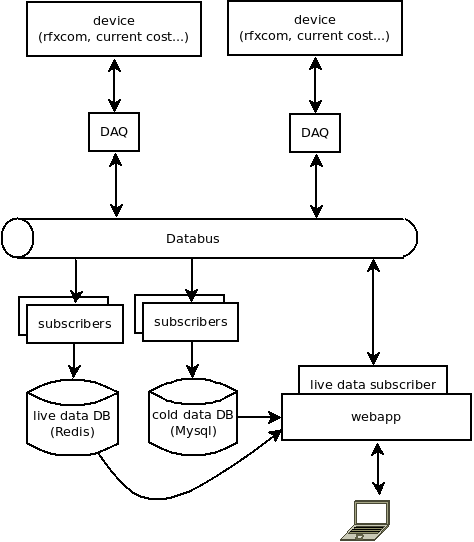

# Goal

This is a framework start, utilities to build a backend for a domotic application.

The idea is that domotic applications should be :
* *event driven*, so we use a data bus (redis at the moment because of its lightweight and convenience)
* *asynchronous*, so we based every IO access (Redis, mysql, web) on python asyncio layer : most of the time, the machine should be idled. A [Raspberry Pi](http://www.raspberrypi.org/) should be able to cope with the load
* *decoupled* : a lot of standards and devices are available and we would like them to coopérate
* *transparent* : we should be able to know what's going on in our home and what is sent on the wire

# Architecture

**D**ata **AQ**uisition modules are responsible for reading from sensors (ex from Current Cost http://www.currentcost.com/) or sending events to emitters (ex [RFXtrx433E](http://www.rfxcom.com/epages/78165469.sf/en_GB/?ViewObjectPath=%2FShops%2F78165469)). They send data on the databus on the appropriate channel.

Then subscribers modules process the data. Most of the time, we need to average data, store history, or display live parameters to users.

For example, we could push power data from current cost sensor to a browser every 6 seconds (for "debuging" power consuption), while storing average every 30 minutes into a "cold data" base.

# Current cost

The data are read from serial XML input according to the specification http://www.currentcost.com/cc128/xml.htm

This is a work in progress.
